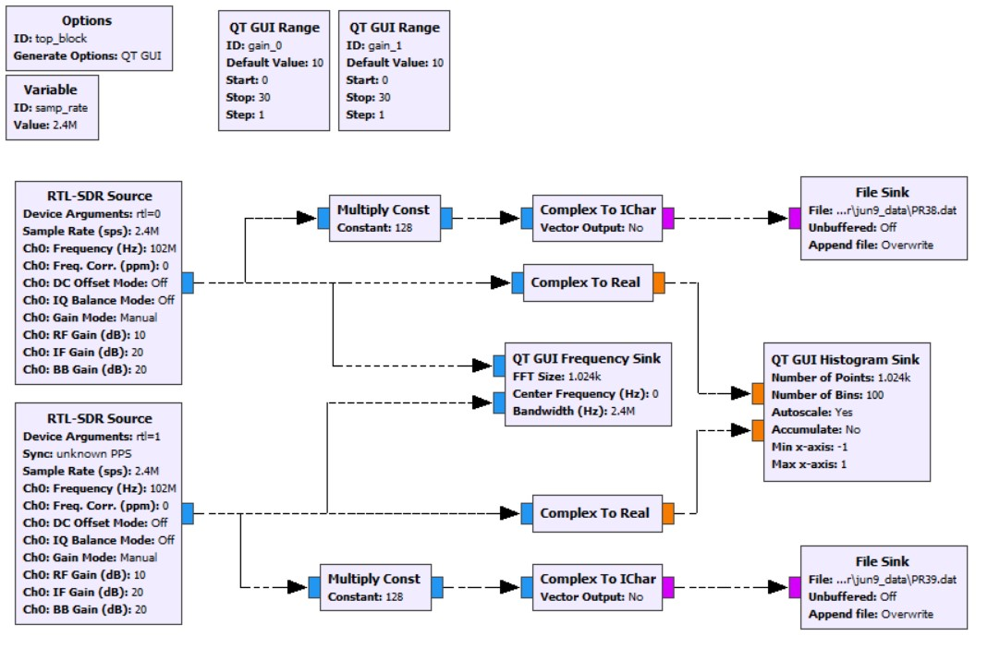

Passive radars locate targets by detecting the echoes of broadcast signals that bounce off of them. This repository contains signal processing scripts for a FM radio based passive radar. Check out [this page](https://dopplerfish.com/passive-radar/) for more information about how passive radar works.

## File Contents

`PRconfig.yaml`: Configuration file for defining passive radar parameters.

`run_processing.py`: The main processing script. Converts raw passive radar input signals into a series of range-doppler maps.

`range_doppler_plot.py`: Plots each of the range-doppler maps and saves them as images. 

`passiveRadar\clutter_removal.py` : Adaptive filter implementations for radar clutter removal.

`passiveRadar\range_doppler_processing.py`: Cross-ambiguity function implementations.

`passiveRadar\signal_utils`: Utility functions for signal processing.

`passiveRadar\target_detection.py`:  Tools for target detection and tracking (Kalman filter based target tracker coming soon)

## Obtaining Passive Radar Data

The following GNUradio block diagram can be used to receive passive radar data from a pair of RTL-SDR dongles [modified to share a clock](http://kaira.sgo.fi/2013/09/16-dual-channel-coherent-digital.html).

*Recording baseband data like this results in pretty large files so unfortunately I can't post any example files in this repository. On a temporary basis you can find a 6GB example file at https://drive.google.com/open?id=18dG__H-nbuHJtG6WCHtPq3c_PRLqJA2O.*

## Input File Format

The program expects the input to be two continuous streams of interleaved IQ data (the reference and observation channels) contained in an hdf5 file.

An easy way to convert binary data files to hdf5 is the `h5import` command-line tool which is included in [the latest hdf5 release](https://www.hdfgroup.org/downloads/hdf5/). See `using_h5import.txt` for brief instructions.

## Algorithm Details

### Least Squares Filtering:

Three least squares filter implementations are provided in `passiveRadar\clutter_removal.py`:

1. `LS_Filter` : direct least squares implementation based on matrix inversion
2. `LS_Filter_SVD` : least squares filter implementation based on the singular value decomposition. Slower than the direct matrix inversion method but guaranteed stability.
3. `LS_Filter_Toeplitz` : least squares filter implementation which makes strong assumptions about the statistical stationarity of the input signals.  Much faster than the previous two implementations but can be inaccurate if the assumptions are violated (in my experience this rarely happens).  
4. `LS_Filter_Multiple`: function for applying a least squares filter across multiple Doppler frequency bins. 
5. `NLMS_filter`: The normalized least mean squares algorithm. Unlike the LS filter implementations (which are block algorithms) this is an online stochastic gradient descent  (SGD) based filter. 
6. `GAL_JPE`: Gradient adaptive lattice joint process estimator. A different kind of SGD-based filter which converges faster than the NLMS algorithm when the autocorrelation matrix of the reference channel signal has a large eigenvalue spread (coloured noise). It is quite a bit more computationally expensive than the other filters listed here and doesn't perform any better in steady state so I wouldn't really recommend using it.

### Range-Doppler Processing

Range-doppler processing is achieved by computing the cross-ambiguity function. Two cross-ambiguity function  implementations are provided in `passiveRadar\range_doppler_processing.py`:

1. `fast_xambg`: Fast cross-ambiguity algorithm which computes the following steps for each range value:

   1. Take the product of the reference channel with the time-shifted surveillance channel

   2. Apply a FIR decimation filter and decimate to the desired range of doppler values (eg. , decimating to 512 Sa/s gives a Doppler range of -256 Hz to 256Hz). 

   3. Take the FFT.

   The decimation filter used in step 2 is a flat-top FIR filter of length 10*(decimation factor)+1.  

2. `direct_xambg`: Time domain implementation of the cross-ambiguity function. 2-3x slower than `fast_xambg` but gives exact results.

## Contributing

Pleas submit an issue if you find any bugs. Also feel free to submit a pull request if you have any additional contributions.

   

   

